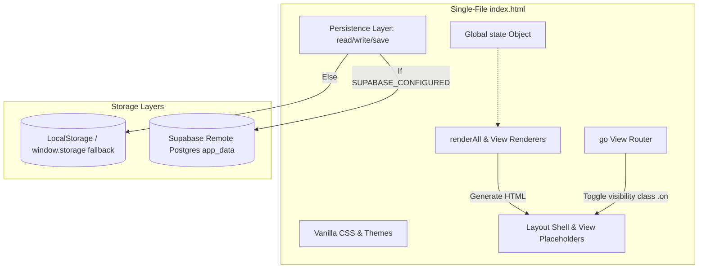

# System Architecture: English Class System (ECS)

This document describes the architectural patterns, state management, routing, and data flow of the ECS single-file application.

## Architectural Patterns
The application follows a **Single-File Single-Page Application (SPA)** pattern. All components, stylesheets, localizations, and application scripts reside within [index.html](file:///c:/Users/jeffc/Downloads/Github%20atualizado%20-%20Copia/index.html).



### 1. View Placeholders & Rendering
The HTML body defines layout shells and empty placeholder elements for each page:
```html
<div id="v-painel" class="view on"></div>
<div id="v-alunos" class="view"></div>
<!-- other views... -->
```
Vanilla JavaScript functions (e.g. `renderPainel()`, `renderAlunos()`) programmatically construct HTML elements via template literals and populate the `innerHTML` of these placeholders.

### 2. Client-Side Routing
Routing is handled through the global `go(view)` function. It:
1. Updates `state.view` to the selected view name.
2. Toggles the `active` class on corresponding sidebar navigation buttons.
3. Toggles the `on` display class on corresponding view placeholder elements.
4. Performs a smooth scroll to the top of the viewport.

### 3. Global State Management
Application state is maintained in a single global `state` object:
```javascript
const state = { 
  students: [], 
  topics: [], 
  lessons: [], 
  view: 'painel', 
  lang: 'pt', 
  authHash: '',
  q_alunos: '', 
  q_topicos: '',
  studentReports: {}, // stores monthly student reports evaluations
  // other module-specific state variables...
};
```
Whenever an operation modifies the state (e.g. adding a student, saving presence, or writing student reports), the data is persisted and corresponding components or `renderAll()` are called to update the UI.

### 4. Data Persistence & Synchronization
Data is stored as stringified JSON keys in a key-value format. ECS abstracts this with three functions:
- `read(key, fallback)`: Returns the value from the database or falls back.
- `write(key, val)`: Updates the value.
- `save(key)`: Wrapper doing `write(key, state[key])`.

If `SUPABASE_CONFIGURED` is true and a user is signed in, data reads and writes are routed to the Supabase table `app_data` with columns `user_id`, `key`, `value` (JSONB), and `updated_at`. Otherwise, operations fallback to `window.storage` (local filesystem storage wrapper) or traditional LocalStorage.

New state structures and custom annotations like `presenca[key].subtopic` are saved directly inside this key-value abstraction.

### 5. Monthly Report UI Page
The system incorporates an isolated "Monthly Report" (Relatório Mensal) page inside the Administration nav group:
- **View Container**: Registered under `v-relatorio-mensal` and wired into the SPA's dynamic router (`go(view)`).
- **Selector Compilation**: Populates selector options asynchronously using the live local database model (`state.students` array), keeping selections updated.
- **Visual Controls**: Provides custom styled selectors for students, months, and years, mapped to "Preview Report" and "Generate PDF" action buttons.


### 6. Lesson Plan UI/UX Enhancements
The Lesson Plan (Plano de Aula) view incorporates advanced SaaS UI layout mechanisms:
- **Card Wrapping & Column Overflow**: Modifies card text tags (`.tp-card-name`) to wrap naturally. Column bodies (`.tp-col-body`) are given independent vertical scroll constraints to prevent breaking page layouts.
- **Filtering & State Routing**: Introduces quick-select level pills that dynamically query and render filtered subsets. In Kanban mode, empty columns are hidden to maximize horizontal layout efficiency.
- **Dual View Modes**: Implements a layout switcher supporting both the standard Kanban column layout and a multi-column card Grid List layout for large-scale library management.

### 7. Theme and Color Modes
Dynamic styling is implemented using CSS variables declared in `:root` and body classes (`.dark`, `.allure`, `.sun`, `.flower`). Swapping styles is instantaneous:
```javascript
function applyTheme(isDark) {
  document.body.classList.toggle('dark', isDark);
}
function applyColorMode(mode) {
  COLOR_MODE_CYCLE.forEach(m => document.body.classList.remove(m));
  document.body.classList.add(mode);
}
```
Combined, these body classes support 8 distinct themes (4 color palettes $\times$ Light/Dark variants).
